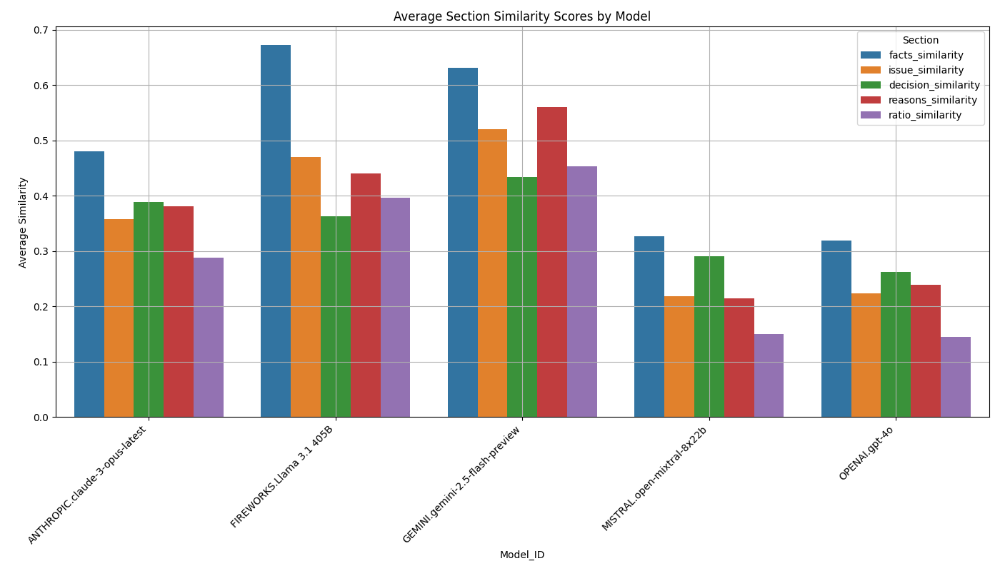

# LLM Benchmark for Canadian Case Law (CCL)

A comprehensive benchmarking tool for evaluating Large Language Models (LLMs) on their ability to analyze and understand Canadian case law. This project tests various LLMs against human-annotated case briefs to measure their accuracy and performance across multiple dimensions.



The above chart shows a sample benchmark comparing different models' performance across various aspects of case analysis.

## Features

- Automated testing of multiple LLM models
- Comprehensive evaluation across key legal analysis dimensions
- CSV output for detailed performance analysis
- Support for various LLM providers through a unified interface

## Supported Models

Basically all LLM models.

## Evaluation Categories

Models are evaluated on their ability to analyze Canadian case law across these dimensions:

1. **Factual Accuracy**: Precision in extracting and summarizing case facts
2. **Ratio Accuracy**: Accuracy in identifying the ratio decidendi
3. **Issue Accuracy**: Precision in identifying legal issues
4. **Hallucination**: Measurement of false or invented information

## Setup

1. Clone the repository:
   ```bash
   git clone [repository-url]
   cd LLMBenchmarkForCCL
   ```

2. Set up environment variables:
   ```bash
   cp .env.example .env
   ```
   Edit `.env` and add your API keys:
   - `CLOD_API_KEY`: Your Clod.io API key (or any other LLM provider API key and implement it using llm_wrapper interface)

3. Prepare your test cases:
   - Place your test cases in `random_cases.csv` or use app_get_random_cases_from_fandom.py to scrape random cases from fandom.

## Usage

1. Generate test cases (optional):
   ```bash
   python app_get_random_cases_from_fandom.py
   ```
   This will scrape case briefs from Fandom with human generated case briefs.

2. Run the benchmark:
   ```bash
   python benchmark_lod.py
   ```
   This generates raw comparison results between AI and human annotations.

3. Evaluate results:
   ```bash
   python rate_embedding.py results/case_model_results_*.csv
   ```
   This computes semantic similarity scores between AI and human annotations. (You will need strong CPU to run this otherwise it will take a long time)

4. Generate visualizations:
   ```bash
   python chart.py
   ```
   This creates comparative charts in the `charts` directory.

5. View results:
   - Raw results: `results/case_model_results_YYYY-MM-DD_HH-MM-SS.csv`
   - Evaluated results: `results/evaluated_case_model_results_with_section_similarity.csv`
   - Visualizations: `charts/model_similarity_chart_YYYY-MM-DD_HH-MM-SS.png`

## Output Format

The benchmark generates a CSV file with the following columns:
- Model_ID: Identifier for the LLM model
- Case_Name: Name of the case being analyzed
- AI outputs (ai_facts, ai_issue, ai_decision, ai_reasons, ai_ratio)
- Human annotations (human_facts, human_issue, human_decision, human_reasons, human_ratio)

## Project Structure

```
├── benchmark_lod.py                    # Main benchmarking script
├── rate_embedding.py                   # Semantic similarity evaluation
├── chart.py                           # Visualization generation
├── app_get_random_cases_from_fandom.py # Test case scraper
├── llm/
│   ├── llm_wrapper.py                 # Base wrapper for LLM interactions
│   ├── llm_lod.py                     # Clod.io specific implementation
│   └── test_lod.py                    # Test utilities
├── ai_models_lod.csv                  # Model configurations
├── random_cases.json                  # Test cases
└── charts/                           # Generated benchmark visualizations
```

## Contributing

Contributions are welcome! Please feel free to submit pull requests.

## Future Improvements

1. Automated accuracy rating using GPT-4 as a judge
2. Support for additional LLM providers
3. Enhanced evaluation metrics
4. Interactive results visualization
