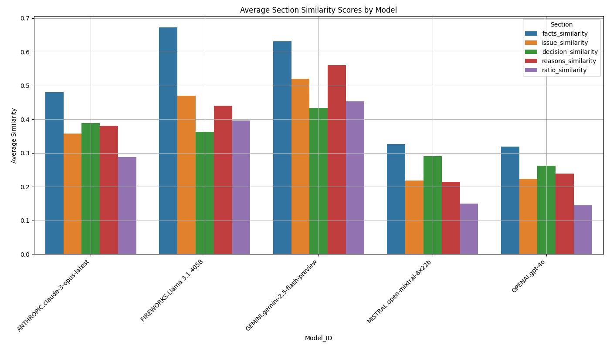

# LLM Benchmark for Canadian Case Law (CCL)

A comprehensive benchmarking tool for evaluating frontier Large Language Models (LLMs) on their ability to analyze and understand Canadian case law. This project tests models against human-annotated case briefs to measure their accuracy and performance across multiple dimensions.

All models are accessed through a single [OpenRouter](https://openrouter.ai/) API key, so adding or swapping a frontier model only means editing one row in `ai_models.csv`.



The above chart shows a sample benchmark comparing different models' performance across various aspects of case analysis.

## Features

- Automated testing of multiple LLM models
- Comprehensive evaluation across key legal analysis dimensions
- CSV output for detailed performance analysis
- Support for various LLM providers through a unified interface

## Supported Models

Any model available on OpenRouter. The default `ai_models.csv` ships with a
curated frontier set spanning the major labs:

- Anthropic — Claude Opus 4.8, Claude Sonnet 4.6
- OpenAI — GPT-5.5, GPT-5.4
- Google — Gemini 2.5 Pro
- xAI — Grok 4.20
- DeepSeek — DeepSeek Chat v3.1
- Meta — Llama 4 Maverick

Run `python -m llm.openrouter_models <filter>` to browse current ids and pricing,
or `python -m llm.openrouter_models --csv <filter>` to regenerate the catalogue.

## Tracks

To separate *knowledge* from *capability* and blunt training-data contamination,
the benchmark runs two tracks:

- **Closed-book** — the model gets only the case name and must recall the brief
  from parametric knowledge. Sensitive to contamination (public cases/summaries
  may be in training data), so treat high scores here with caution.
- **Open-book / temporal holdout** — the model is given the full decision text
  (from [A2AJ](https://a2aj.ca/)) and must brief it. This is a reading task, not
  recall; using decisions issued *after* model training cutoffs makes it
  contamination-resistant.

## Metrics

Each brief is scored on several independent axes (no single number captures
legal quality):

1. **Rubric score (primary)** — HealthBench-style checklist grading: a strong
   model authors 12–20 atomic, point-weighted, case-specific criteria per case
   (grounded in the reference brief or decision text, including negative
   criteria for likely hallucinations), and a grader model verifies whether
   each criterion is met. Score = weight met ÷ total weight. Rubrics are
   versioned in `rubrics/rubrics.json`. This restored score discrimination that
   holistic judging lacked (a measured ceiling effect).
2. **Judge score (secondary)** — an LLM-as-judge grades each section 1–5 on
   **accuracy**, **completeness**, and **groundedness** (freedom from invented
   facts/holdings/citations). Closed-book grades against the human reference
   brief; open-book grades faithfulness to the decision text.
3. **Cosine similarity (secondary)** — sentence-embedding similarity to the
   reference. A cheap topical signal; it cannot distinguish a fluent-but-wrong
   brief from a correct one, so it is not the headline number.
4. **Hallucination-safety** — mean judge groundedness.
5. **Format compliance / refusal / truncation rates** — reported separately so
   a malformed, cut-off, or abstaining response is not confused with a wrong
   answer; the primary score covers valid responses only.
6. **Cost & latency** — per-case token cost and response time.

All headline scores carry **95% bootstrap confidence intervals**, and gaps that
are not statistically distinguishable are flagged.

## Setup

1. Clone the repository:
   ```bash
   git clone [repository-url]
   cd LLMBenchmarkForCCL
   ```

2. Set up environment variables:
   ```bash
   cp .env.example .env
   ```
   Edit `.env` and add your API key:
   - `OPENROUTER_API_KEY`: Your OpenRouter API key (get one at https://openrouter.ai/keys). To use a different provider, implement the `LLM_Wrapper` interface (see `llm/openrouter.py`).

3. Prepare your test cases:
   - Place your test cases in `random_cases.csv` or use `app_get_random_cases_from_fandom.py` to scrape random cases from Fandom.

## Usage

1. Generate test cases (optional):
   ```bash
   python app_get_random_cases_from_fandom.py
   ```
   This will scrape case briefs from Fandom with human generated case briefs.

2. (Optional) Build a contamination-resistant holdout from A2AJ:
   ```bash
   python a2aj.py holdout --start 2025-06-01 --limit 20 --out random_cases_holdout.csv
   ```
   Pulls recent Canadian decisions (with full text) issued after model training
   cutoffs. `python a2aj.py coverage` lists available courts and date ranges.

3. Run the full pipeline (recommended):
   ```bash
   python benchmark_and_rate.py --holdout random_cases_holdout.csv
   ```
   This runs the closed-book track (recall → cosine + judge) and, if a holdout
   is given, the open-book track (decision text → judge), then combines them,
   builds the report, and refreshes the site. Flags: `--no-judge`,
   `--judge <model_id>`, `--max-cases N`, `--models`, `--cases`.

   Individual stages, if you want them separately:
   ```bash
   python benchmark.py --mode closed                 # or --mode open --cases <holdout>
   python rate_embedding.py results/case_model_results_*.csv   # cosine (needs a strong CPU)
   python judge.py results/evaluated_*.csv --judge google/gemini-2.5-pro   # LLM-judge
   ```

4. Generate visualizations:
   ```bash
   python chart.py       # standalone PNG bar chart in charts/
   python report.py results/evaluated_case_model_results_with_section_similarity.csv
   ```
   `report.py` builds a self-contained HTML report (embedded chart + side-by-side
   AI/human briefs) at `results/report.html`.

5. Refresh the LexBench site:
   ```bash
   python lexbench.py
   ```
   This regenerates the published landing page at `docs/index.html` from the
   latest evaluated results (see **Publishing** below).

6. View results:
   - Raw results: `results/case_model_results_YYYY-MM-DD_HH-MM-SS.csv`
   - Evaluated results: `results/evaluated_case_model_results_with_section_similarity.csv`
   - HTML report: `results/report.html`
   - Public site: `docs/index.html`

> `python benchmark_and_rate.py` runs steps 2–5 end to end: benchmark → score →
> report → refresh the LexBench site.

## Publishing (LexBench)

**LexBench** is the public landing page for the benchmark — a self-contained
static site (`docs/index.html`) with the current leaderboard, a section-by-section
chart, and methodology. It is regenerated from the latest evaluated results on
every run, so publishing stays as simple as committing `docs/` and pushing.

To publish it for free with **GitHub Pages**:

1. Commit and push the `docs/` folder.
2. On GitHub: **Settings → Pages → Build and deployment → Source: Deploy from a
   branch**, then choose **Branch: `main`, Folder: `/docs`** and save.
3. The site goes live at `https://okelot.github.io/LLMBenchmarkForCCL/`.

Each subsequent run overwrites `docs/index.html`; commit and push to update the
live site (`docs/.nojekyll` is included so Pages serves the files as-is).

## Output Format

The benchmark generates a CSV file with the following columns:
- Model_ID: Identifier for the LLM model
- Case_Name: Name of the case being analyzed
- AI outputs (ai_facts, ai_issue, ai_decision, ai_reasons, ai_ratio)
- Human annotations (human_facts, human_issue, human_decision, human_reasons, human_ratio)

## Project Structure

```
├── benchmark.py                        # Benchmark runner (closed/open-book)
├── benchmark_and_rate.py               # Full pipeline: run -> score -> judge -> site
├── rate_embedding.py                   # Cosine similarity evaluation
├── judge.py                            # LLM-as-judge rubric scorer
├── stats.py                            # Bootstrap confidence intervals
├── a2aj.py                             # A2AJ client + temporal-holdout builder
├── report.py                           # Per-run HTML report (briefs + chart)
├── lexbench.py                         # LexBench landing-page generator
├── chart.py                            # Standalone PNG chart
├── app_get_random_cases_from_fandom.py # Closed-book case scraper
├── llm/
│   ├── llm_wrapper.py                  # Base wrapper interface
│   ├── openrouter.py                   # OpenRouter implementation
│   ├── openrouter_models.py            # Catalogue browser / CSV refresher
│   └── test_openrouter.py              # Smoke test
├── ai_models.csv                       # Frontier model configurations
├── random_cases.csv                    # Test cases (human-annotated briefs)
├── docs/                               # Published LexBench site (GitHub Pages)
└── charts/                             # Generated benchmark visualizations
```

## Contributing

Contributions are welcome! Please feel free to submit pull requests.

## Methodology notes

- **Contamination.** Closed-book uses public cases whose summaries may be in
  training data — a high score can reflect memorisation. The open-book and
  temporal-holdout tracks (A2AJ decisions issued after model cutoffs) are the
  contamination-resistant signal.
- **Judge caveats.** LLM judges carry self-preference bias and cost. Use a judge
  from a different family than the leading contestants, keep the judge model and
  prompt pinned, and validate against a small human-labelled sample before
  trusting absolute numbers.
- **Reproducibility.** Models are pinned in `ai_models.csv`, decoding is
  temperature 0, and prompts/judge/embedding models are fixed. OpenRouter
  provider routing can vary backend/quantization run to run — pin a provider for
  byte-exact reproducibility.
- **Licensing.** A2AJ methods are MIT; individual decisions keep upstream terms
  (often non-commercial). Full decision text is not republished on the site.

## Future Improvements

1. Expand to a multi-task suite (issue-spotting, citation validity, holding
   extraction) in the spirit of LegalBench's IRAC taxonomy
2. Human-expert validation of a judge-scored sample
3. Authoritative reference briefs (official headnotes) beyond crowd sources
4. Larger, versioned datasets with datasheets and contamination canaries
